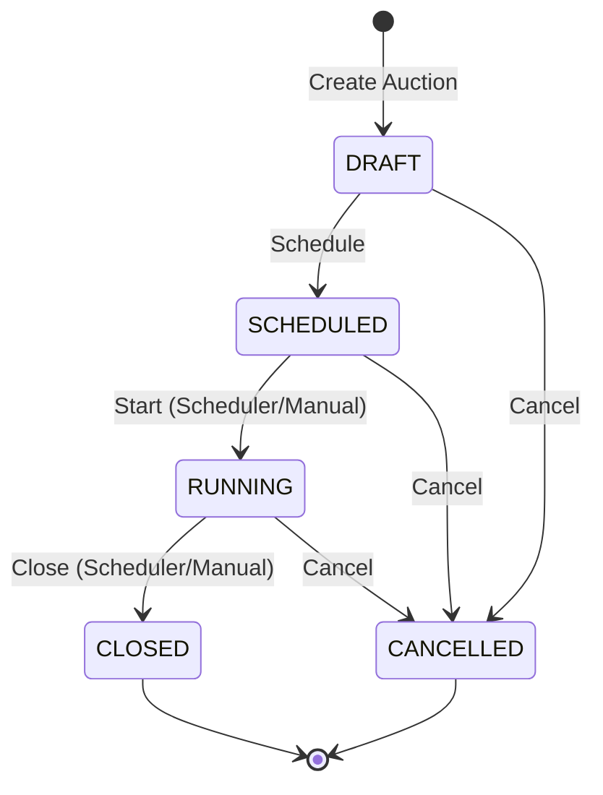
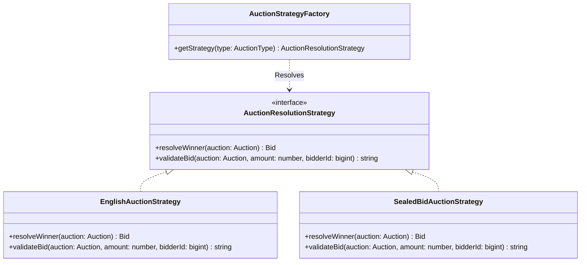
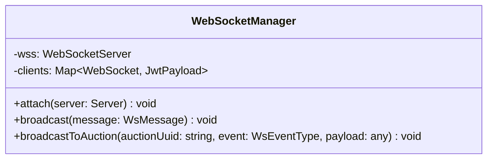

# 🔨 Catalog of Goods & Auction Management System Backend

This repository contains the Node.js, Express, TypeScript, and Sequelize backend for the Catalog of Goods and Auction Management System.

---

## 🚀 Features

- **Strict MVC Design Pattern**: Clear separation of concern between database models, formatters (Views), and Controllers.
- **Advanced Behavioral Design Patterns**:
  - **State Pattern**: Manage transitions of auction lifecycle (`DRAFT`, `SCHEDULED`, `RUNNING`, `CLOSED`, `CANCELLED`).
  - **Strategy Pattern**: Flexible winner resolution and bid validation rules (`ENGLISH` vs `SEALED_BID` auctions).
  - **Observer Pattern**: Real-time event broadcasting over WebSockets.
  - **Facade Pattern**: Secure database transactions grouping winner resolution, wallet balances deduction, and receipt generation.
- **Security Key-Pair authentication**: Signed RS256 JWT tokens containing strictly user metadata.
- **RESTful Endpoints**: Route management using public UUIDs instead of database auto-incrementing BigInt IDs.

---

## 📊 Design Patterns & UML Diagrams

### 1. State Pattern (Auction States)

Controls auction transitions across `DRAFT`, `SCHEDULED`, `RUNNING`, `CLOSED`, and `CANCELLED`. Bidding is strictly only allowed in the `RUNNING` state.



### 2. Strategy Pattern (Auction Winner & Bid Validation)

Separates winner resolution and bid validation rules for different auction types (`ENGLISH` vs `SEALED_BID`).



### 3. Observer Pattern (WebSocket Manager)

Broadcasts real-time events (`PRICE_UPDATE`, `NEW_BID`, `AUCTION_START`, `AUCTION_CLOSE`, `AWARD_COMPLETED`) to connected subscribers.



---

## 🛠️ Getting Started

### Prerequisites

- Node.js (v18 or v20)
- Docker & Docker Compose
- PostgreSQL (if running locally without Docker)

### 1. Configure Environment Variables

Create a `.env` file in the root directory:
```bash
cp .env.example .env
```
Fill in your database credentials and generate RSA keys.

### 2. Generate RSA Keypair for JWT Signatures

Run the key generator script:
```bash
node scripts/generateKeys.js
```
Then copy-paste the contents of `/keys/private.pem` and `/keys/public.pem` into the `JWT_PRIVATE_KEY` and `JWT_PUBLIC_KEY` fields of your `.env` file.

### 3. Run with Docker Compose

Spin up both the PostgreSQL database and the TypeScript application:
```bash
docker-compose -f docker/docker-compose.yml up --build
```

### 4. Database Setup & Seeding (Local Dev)

To run migrations and seed data on local machine:
```bash
npx sequelize-cli db:migrate
npx sequelize-cli db:seed:all
```

---

## 🧪 Testing

To run the Jest test suite:
```bash
npm run test
```

---

## 🔌 API & WebSocket Documentation

### REST Endpoints
- **Authentication**: `POST /api/v1/auth/register`, `POST /api/v1/auth/login`
- **Goods**: `POST /api/v1/goods`, `GET /api/v1/goods`
- **Auctions**: `POST /api/v1/auctions`, `GET /api/v1/auctions`, `PATCH /api/v1/auctions/:uuid/state`, `GET /api/v1/auctions/:uuid/receipt`
- **Bids**: `POST /api/v1/auctions/:uuid/bids`, `GET /api/v1/auctions/:uuid/bids`
- **Wallets**: `GET /api/v1/wallet/balance`, `POST /api/v1/admin/wallet/recharge`
- **Statistics**: `GET /api/v1/admin/statistics`

### WebSocket Connection
Connect via WS clients on port `3000` with the authorization token:
```
ws://localhost:3000?token=<YOUR_JWT_TOKEN>
```
The client will receive real-time notifications when bid increments or closures occur.

### Postman Testing References
You can import the Postman collection to test the entire suite of API endpoints. Use the headers `Authorization: Bearer <token>` to authenticate requests.
