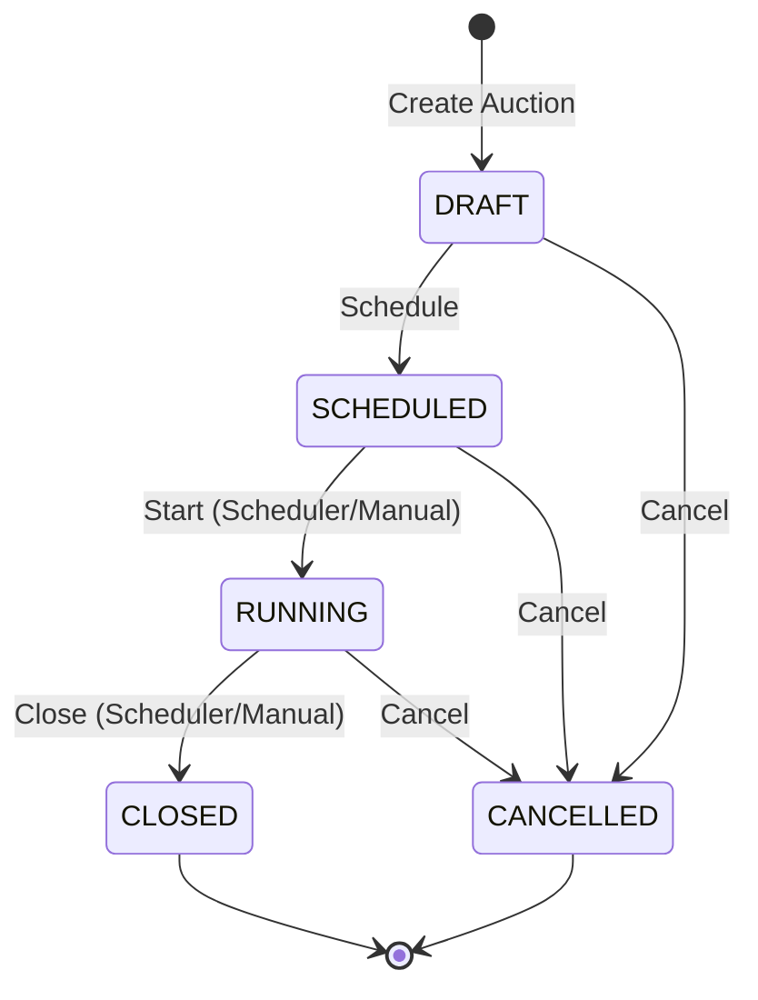
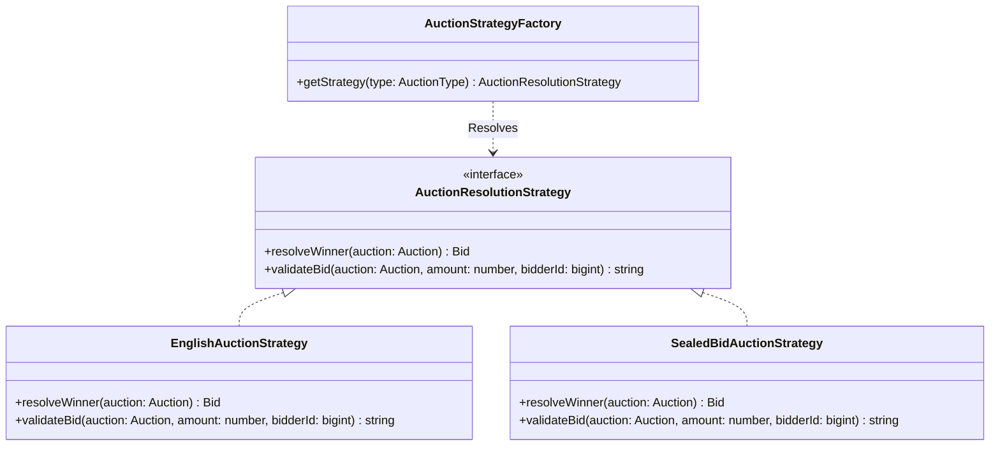
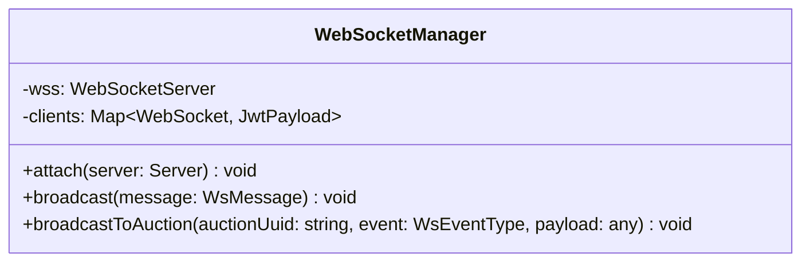

# 📊 Design Patterns & UML Diagrams

This section outlines the architectural patterns used in the Catalog of Goods and Auction Management System backend.

## 1. State Pattern (Auction States)

Controls auction transitions across `DRAFT`, `SCHEDULED`, `RUNNING`, `CLOSED`, and `CANCELLED`. Bidding is strictly only allowed in the `RUNNING` state.

## 2. Strategy Pattern (Auction Winner & Bid Validation)

Separates winner resolution and bid validation rules for different auction types (`ENGLISH` vs `SEALED_BID`).

## 3. Observer Pattern (WebSocket Manager)

Broadcasts real-time events (`PRICE_UPDATE`, `NEW_BID`, `AUCTION_START`, `AUCTION_CLOSE`, `AWARD_COMPLETED`) to connected subscribers.

